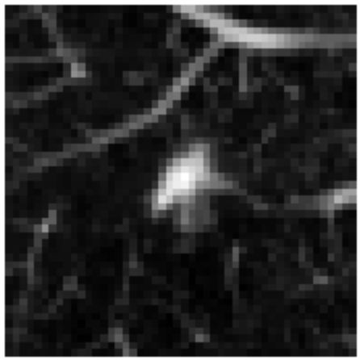

1. ResNet-18 without batch norm

Файл модели: models/resnet18_2021-04-01_21:38:45.pt

val Loss: 0.4591 Acc: 0.8512 LR: 0.001 AP: 0.8883389035343003

id   path                     prob          y_pred    y_true
598  data/nodules/598.npy     0.715619      1         1

L2 - 13.343865

Семплов меньше 0.5 - 420 (420 / 10000 = 4.2%)

2. Bounded RELU

Файл модели: models/resnet18_2021-04-01_21:38:45.pt

val Loss: 0.4497 Acc: 0.8631 AP: 0.8959

Семплов меньше 0.5 - 308 (308 / 10000 = 3.08%)

3. Noise Aug

models/resnet18_2021-04-02_03:29:09.pt

val Loss: 0.4351 Acc: 0.8810 LR: 0.0001 AP: 0.9175

Семплов меньше 0.5 - 169 (169 / 10000 = 1.69%)

4. Adversarial train

models/resnet18_2021-04-03_02:38:35.pt

val Loss: 0.6098 Acc: 0.8681 AP: 0.8508

Семплов меньше 0.5 - 1 (1 / 10000 = 0.01%)

